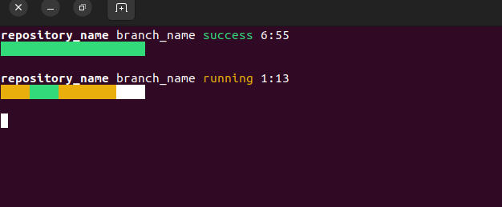

Drone Monitor
=============

This siple tool introduces useful Drone dashboard into the terminal. It shows basic info about pending or recently done builds owned by the user. After the build is done, a system popup notiffication will apperar.

Screenshots
-----------



How to use
----------

You can provide Drone service base domain and API key via CLI or provide it in `config.yml` file. Config example:

```yaml
domain: https://drone.yourdomain.com/
api_key: API_KEY
```
Contributors
------------

* Author: Maciej Wichowski <maciek.wichowski@gmail.com>


> * Tested on Ubuntu 22.04
> * This project was created based on specific Drone workflow. If it doesn't meet your expectations, feel free to contribute.
